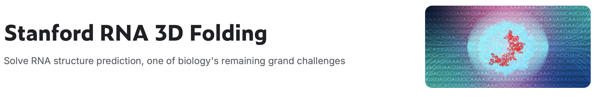
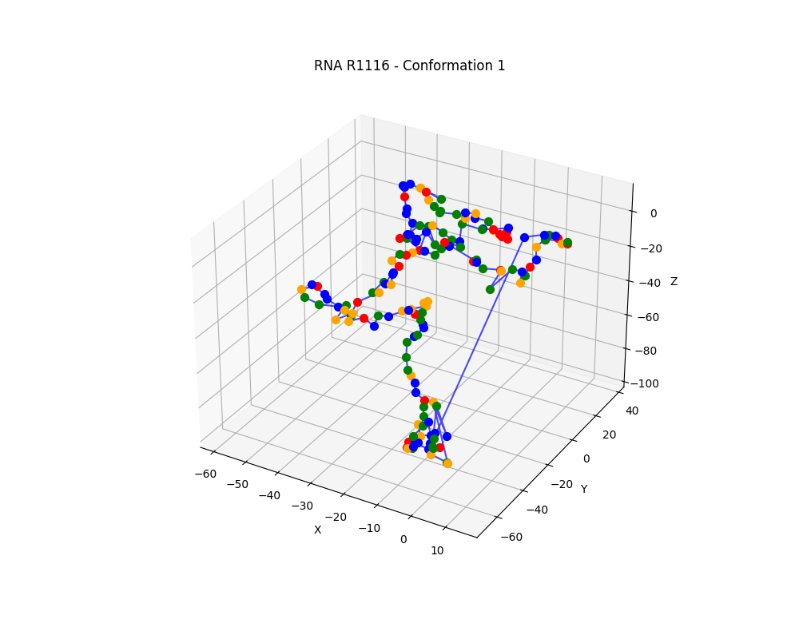
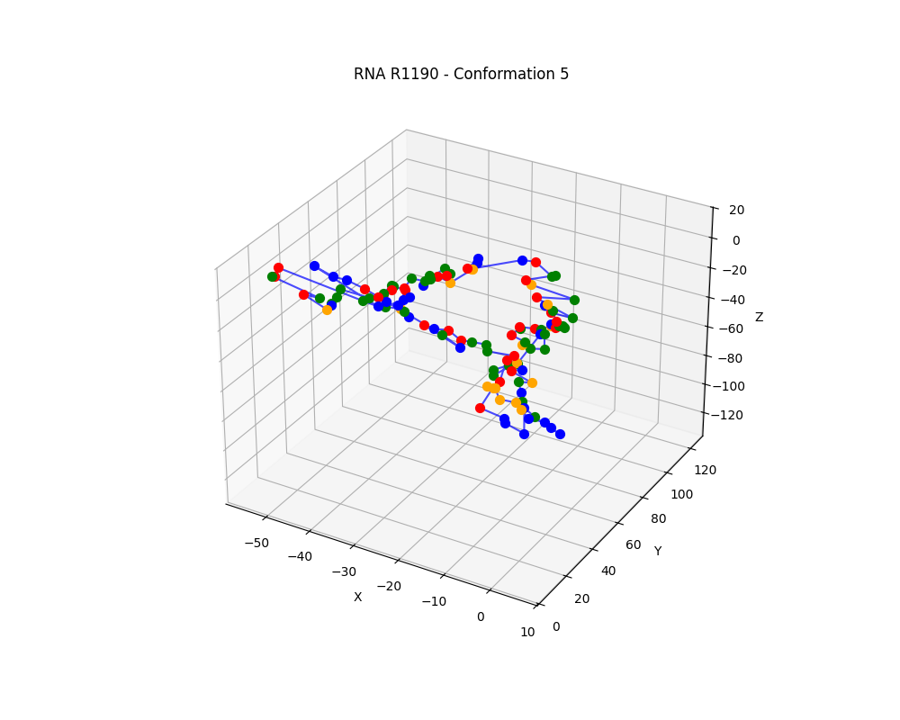
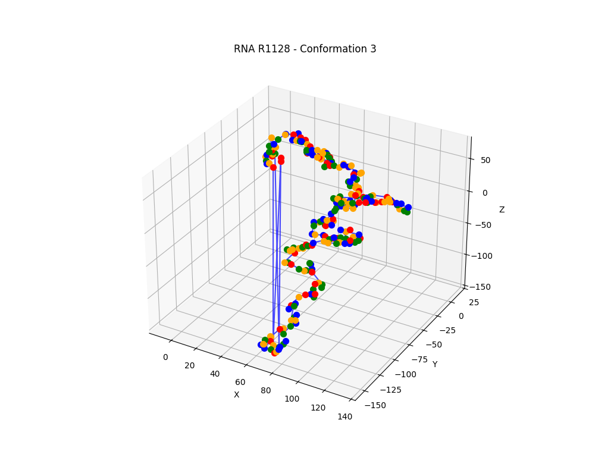
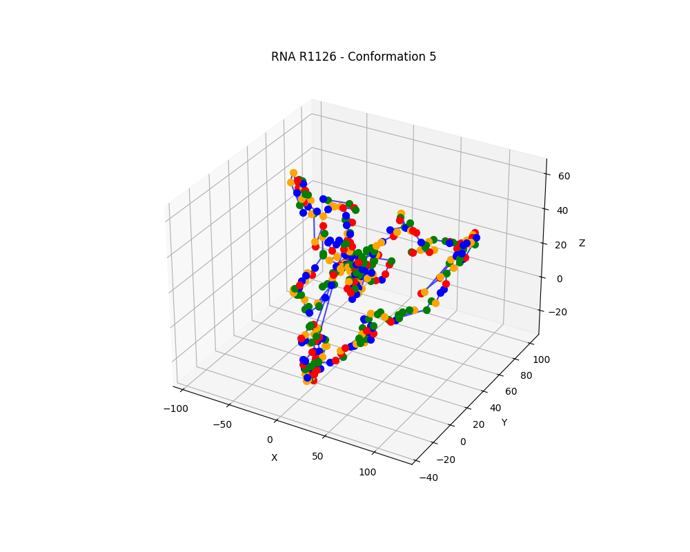
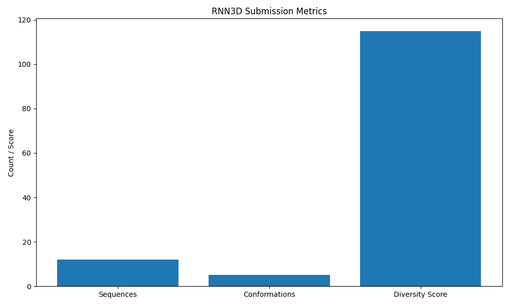

# RNN3D: Advanced RNA 3D Structure Prediction Project 🧬🔬



> *Unraveling RNA's Structural Mysteries with Machine Learning*

**Note**: Project screenshots and detailed visual documentation will be added in future updates.

## 🌟 Project Overview

RNN3D is a cutting-edge computational biology project designed to revolutionize RNA structure prediction through advanced machine learning techniques. By leveraging sophisticated neural network architectures and bioinformatics tools, this project aims to generate accurate three-dimensional representations of RNA molecules.

<div style="display: flex; gap: 10px;">
  
  
  
  
</div>

## 🔬 Key Features

### Advanced Prediction Capabilities
- Generate up to 5 different 3D conformations per RNA sequence
- Utilize machine learning algorithms for structure prediction
- Integrate ViennaRNA for secondary structure analysis
- Handle complex RNA sequences with intelligent preprocessing

### Technical Highlights
- Recurrent Neural Network (RNN) based architecture
- Multiple sequence alignment (MSA) processing
- Stochastic coordinate generation
- Comprehensive validation and visualization tools

## 🔬 Performance



## 🚀 Installation and Setup

### Prerequisites
- Python 3.8+
- Computational resources (recommended GPU)
- Optional: ViennaRNA installed

### Installation Steps

1. **Clone the Repository**
   ```bash
   git clone https://github.com/yourusername/RNN3D.git
   cd RNN3D
   ```

2. **Create Virtual Environment**
   ```bash
   # Using venv
   python -m venv rnn3d_env
   
   # Activate environment
   # Linux/macOS
   source rnn3d_env/bin/activate
   
   # Windows
   rnn3d_env\Scripts\activate
   ```

3. **Install Dependencies**
   ```bash
   pip install -r requirements.txt
   ```

4. **Verify Installation**
   ```bash
   python main.py
   ```

## 📊 Machine Learning Pipeline

### Stages of Processing
1. **Data Ingestion**
   - Automated dataset download
   - Extraction and validation
   - Supports various file formats

2. **Data Preparation**
   - Sequence encoding (one-hot and MSA)
   - Training/validation splits
   - Preprocessing for neural network input

3. **Model Prediction**
   - Generate multiple RNA conformations
   - Create submission-ready CSV files
   - Handle complex sequence scenarios

## 🖥️ Web Interface Features

### Interactive Visualization
- 3D RNA structure rendering
- Multiple conformation exploration
- Real-time structure prediction
- Performance metrics dashboard

### Prediction Capabilities
- Input RNA sequences (A, C, G, U)
- Generate secondary and tertiary structures
- Support for sequences up to 480 nucleotides

## 📈 Performance Metrics

The project tracks various performance indicators:
- Number of valid conformations
- Structural diversity
- Computational efficiency
- Prediction accuracy compared to experimental data

## 🧪 Research Applications

Potential Use Cases:
- Drug design targeting RNA
- Understanding genetic disorders
- Computational biology research
- RNA-protein interaction prediction

## 🔧 Configuration

Key configuration parameters are managed through YAML files:

### Model Hyperparameters (`params.yaml`)
```yaml
batch_size: 32            # Batch processing size
max_length: 480           # Maximum sequence length
num_conformations: 5      # Multiple structure generations

# Neural Network Configuration
hidden_size: 256          # Internal network complexity
num_layers: 6             # Network depth
dropout: 0.1              # Regularization technique
learning_rate: 0.001      # Optimization parameter
weight_decay: 0.0001      # Prevent overfitting
```

## 🤝 Contributing

### How to Contribute
1. Fork the repository
2. Create a feature branch
3. Commit changes with descriptive messages
4. Push and create a pull request

### Contribution Focus Areas
- Data preprocessing improvements
- Machine learning model enhancements
- Performance optimization
- Documentation expansion

## 📚 Dependencies

- TensorFlow 2.16.1
- Pandas
- NumPy
- Flask
- Matplotlib
- Seaborn
- ViennaRNA (Optional)

## 🌐 Web Interface

Access the interactive RNA structure prediction platform by running:
```bash
python main.py
```

The web interface will be available at `http://localhost:5001`

## 🗺️ Future Roadmap

- Integrate more advanced ML architectures
- Expand dataset diversity
- Improve prediction accuracy
- Develop enhanced visualization techniques

## 🙏 Acknowledgments

- Stanford RNA 3D Folding Dataset
- ViennaRNA Project
- Machine Learning in Computational Biology community

---

**Note**: This project is a testament to the incredible potential of machine learning in unraveling the complex world of RNA structural biology. 🧬🤖